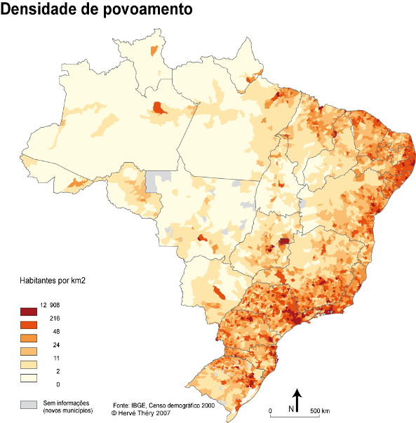

```{r setup, include=FALSE}
knitr::opts_chunk$set(echo = FALSE)
library(brazilmaps)
library(sf)
library(rgeos)
library(maptools)
library(anytime)
library(dplyr)
library(ggvis)
library(Cubist)
library(neuralnet)
library(kernlab)
library(psych)
fire <- read.csv("data/forestfire.csv", encoding = "UTF-8", sep = "\t", stringsAsFactors = F)
fire <- fire[-260, ]
fire$Date <- utcdate(fire$Date)
fire$Month <- factor(x = fire$Month, 
                     levels = c("Janeiro", "Fevereiro", "Marco", "Abril", 
                                "Maio", "Junho", "Julho", "Agosto", 
                                "Setembro", "Outubro", "Novembro", "Dezembro"),
                     labels = c(1:12),
                     ordered = T)
fire$Month <- as.numeric(fire$Month)

# 주별 지역 구해서 조인하기
regions <- data.frame(Region = rep(c("North", "Northeast", "Central-West", "Southeast", "South"), times = c(7, 9, 4, 4, 3)),
                      State = c("Acre", "Amapa", "Amazonas", "Para", "Rondonia", "Roraima", "Tocantins",
                                "Alagoas", "Bahia", "Ceara", "Maranhao", "Paraiba", "Pernambuco", "Piaui", "Rio Grande do Norte", "Sergipe",
                                "Goias", "Mato Grosso", "Mato Grosso do Sul", "Distrito Federal",
                                "Espirito Santo", "Minas Gerais", "Rio de Janeiro", "Sao Paulo",
                                "Parana", "Rio Grande do Sul", "Santa Catarina"),
                      stringsAsFactors = F)

fire <- fire %>% left_join(regions, by = "State")
fire <- fire[-5]

# 연도/월별 산불 발생 중앙값
fire_year <- fire %>% group_by(Year) %>% summarise(sum = sum(Number), mean = mean(Number), med = median(Number))
fire_month <- fire %>% group_by(Month) %>% summarise(sum = sum(Number), mean = mean(Number), med = median(Number))
fire_region_year <- fire %>% group_by(Year, Region) %>% summarise(sum = sum(Number), mean = mean(Number), med = median(Number))
fire_region_month <- fire %>% group_by(Month, Region) %>% summarise(sum = sum(Number), mean = mean(Number), med = median(Number))

# 주별 브라질 지도 데이터
brmap <- get_brmap(geo = "State", class = "data.frame")

# state id 데이터프레임 만들기
state_id <- data.frame(state = unique(fire$State),
                       id = as.character(c(12, 27, 16, 13, 29, 23, 53, 32, 52, 21, 51, 50, 31, 15, 25, 41, 26, 22, 33, 24, 43, 11, 14, 42, 35, 28, 17)),
                       stringsAsFactors = F)

# brmap에 주별 산불 발생 중간값을 구해서 조인
fire_med <- fire %>% group_by(State) %>% summarise(med = median(Number))
fire_med <- fire_med %>% left_join(state_id, by = c("State" = "state"))
brmap <- brmap %>% left_join(fire_med, by = "id")

load("data/fire_weather.rda")

# 연도/월별 산불 발생 중앙값
fire_year <- fire_weather %>% group_by(Year) %>% summarise(sum = sum(Number), mean = mean(Number), med = median(Number))
fire_month <- fire_weather %>% group_by(Month) %>% summarise(sum = sum(Number), mean = mean(Number), med = median(Number))
fire_region_year <- fire_weather %>% group_by(Year, Region) %>% summarise(sum = sum(Number), mean = mean(Number), med = median(Number))
fire_region_month <- fire_weather %>% group_by(Month, Region) %>% summarise(sum = sum(Number), mean = mean(Number), med = median(Number))
```

## 목차

- 들어가며
- 브라질 간단 소개
- 데이터 탐구: 산불 데이터
- 데이터 탐구: 날씨 데이터
- 산불과 날씨의 연관성
- 머신러닝
- 나가며

# 들어가며

## 분석 동기

{ height=500px }

## 사용한 데이터

### 1998 ~ 2017년 주(州)별 산불 발생 데이터(월 단위)
```{r fire_intro}
head(fire)
```

## 사용한 데이터(계속)

### 2010 ~ 2017년 관측소 날씨 데이터(시간 단위)
{ width=70% }

- 기온
- 습도
- 이슬점
- 기압
- 풍속
- 풍향
- 태양 복사에너지
- 강수량

# 브라질 간단 소개

## 행정구역

### 5개 지역 / 27개 주

{ width=65% }


## 지형, 인구밀도
{ width=45% }  { width=45% }


# 데이터 탐구: 산불 데이터

## 데이터 탐구: 산불 데이터

### 1998 ~ 2017년 주(州)별 산불 발생 데이터(월 단위)
```{r fire_intro2}
head(fire)
```

## 산불 데이터

### 발생량 분포
```{r fire_hist}
fire %>% ggvis(~Number) %>% layer_histograms() %>% add_axis("x", title = "Fire") %>% add_axis("y", title_offset = 50)
```

## 연, 월별 산불 발생량

```{r fire_time}
shinyApp(
  
  ui = fluidPage(
    fluidRow(
      column(5,
        selectInput("x_axis", "시간 단위 선택", 
                     choices = list("연도별" = "Year", "월별" = "Month"),
                     selected = "Year"),
        checkboxInput("region", "지역별로 보기", value = F)
      ),
      column(5,
      radioButtons("metric", "통계치 선택",
                   choices = list("합계" = "sum", "평균" = "mean", "중앙값" = "med"), selected = "med")
    )),
    ggvisOutput("fire_timeplot"),
    uiOutput("fire_timeplot_ui")
  ),
  
  server = function(input, output) {
    plotdata_firetime <- reactive({
    if(input$x_axis == "Year" & input$region == F)
      df <- fire_year %>% select(x = Year, y = input$metric)
    else if(input$region == F)
      df <- fire_month %>% select(x = Month, y = input$metric)
    else if(input$x_axis == "Year")
      df <- fire_region_year %>% select(x = Year, y = input$metric, Region)
    else
      df <- fire_region_month %>% select(x = Month, y = input$metric, Region)
    df
    })

    observe({
      if(input$region == F)
        plotdata_firetime() %>% ggvis(x = ~x, y = ~y) %>% layer_lines() %>% 
        add_axis("x", title = input$x_axis) %>% add_axis("y", title = input$metric, title_offset = 60) %>% bind_shiny("fire_timeplot", "fire_timeplot_ui")
      else
        plotdata_firetime() %>% ggvis(x = ~x, y = ~y, stroke = ~Region) %>% layer_lines() %>% 
        add_axis("x", title = input$x_axis) %>% add_axis("y", title = input$metric, title_offset = 55) %>% bind_shiny("fire_timeplot", "fire_timeplot_ui")
    })
  }
  
)
```

## 지역별 산불 발생량

```{r fire_state}
shinyApp(

  ui <- fluidPage(
    actionButton("bp", "Boxplot"),
    actionButton("map", "Map"),
    ggvisOutput("fire_state"),
    uiOutput("fire_state_ui")
  ),

  server = function(input, output) {
    fire_weather %>% ggvis(~State, ~Number, fill = ~Region) %>% layer_boxplots() %>% 
      add_axis("x", title_offset = 100, properties = axis_props(labels = list(angle = 90, align = "left"))) %>% 
      add_axis("y", title = "Fire", title_offset = 55) %>% bind_shiny("fire_state", "fire_state_ui")
    observeEvent(input$bp, {
      fire_weather %>% ggvis(~State, ~Number, fill = ~Region) %>% layer_boxplots() %>% 
        add_axis("x", title_offset = 100, properties = axis_props(labels = list(angle = 90, align = "left"))) %>% 
        add_axis("y", title = "Fire", title_offset = 55) %>% bind_shiny("fire_state", "fire_state_ui")
    })
    
    fire_value <- function(x) {
      if(is.null(x)) return(NULL)
      df <- fire_med %>% filter(id == x$id) %>% select(1:2)
      paste0(as.character(df[1, 1]), ": ", df[1, 2], collapse="<br />")
    }
    
    observeEvent(input$map, {
      brmap %>% group_by(id, group) %>% ggvis(~long, ~lat) %>% layer_paths(fill = ~med, strokeOpacity:=0.5) %>% set_options(width = 600, height = 400, keep_aspect = T) %>% 
        scale_numeric("fill", range=c("white", "darkred")) %>% add_legend("fill", title = "Monthly Reported Forest Fire") %>% hide_axis("x") %>% hide_axis("y") %>% 
        add_tooltip(fire_value, "hover") %>% bind_shiny("fire_state", "fire_state_ui")
    })
  }

)
```

# 데이터 탐구: 날씨 데이터

## 데이터 탐구: 날씨 데이터
### 2010 ~ 2017년의 관측소 날씨 데이터(시간별)
→ 월 단위로 평균을 계산해서 산불 발생 데이터에 left join
```{r weather_intro}
head(fire_weather)
```

## 관측치 분포
```{r weather_hist}
shinyApp(

  ui <- fluidPage(
    selectInput("hist_weather", "관측치 선택",
                 choices = colnames(fire_weather[-c(1:5)])),
    ggvisOutput("weather_hist"),
    uiOutput("weather_hist_ui")
  ),

  server = function(input, output) {
    plotdata <- reactive({
      df <- fire_weather[input$hist_weather]
      names(df) <- "y"
      df
    })
    observe({
      plotdata() %>% ggvis(~y) %>% layer_histograms() %>% add_axis("y", title_offset = 40) %>% add_axis("x", title = input$hist_weather) %>% bind_shiny("weather_hist", "weather_hist_ui")
    })
  }

)
```

## 월에 따른 날씨 변화
```{r weather_time}
shinyApp(

  ui <- fluidPage(
    fluidRow(
        column(5,
            selectInput("month_weather", "관측치 선택",
                        choices = colnames(fire_weather[-c(1:5)]),
                        selected = "temp")
        ),
        column(5,
            checkboxInput("weather_region", "지역별로 보기", value = F)
        )
    ),
    ggvisOutput("weather_month"),
    uiOutput("weather_month_ui")
  ),

  server = function(input, output) {
    plotdata2 <- reactive({
      df <- fire_weather[c("Month", input$month_weather, "Region")]
      names(df) <- c("Month", "y", "Region")
      df
    })
    
    observe({
      if(input$weather_region == F)
        plotdata2() %>% group_by(Month) %>% summarise(med = median(y)) %>% ggvis(~Month, ~med) %>% layer_lines() %>% bind_shiny("weather_month", "weather_month_ui")
      else
        plotdata2() %>% group_by(Month, Region) %>% summarise(med = median(y)) %>% ggvis(~Month, ~med, stroke = ~Region) %>% layer_lines() %>% bind_shiny("weather_month", "weather_month_ui")
    })
  }

)
```

# 산불과 날씨의 연관성

## 산불과 날씨의 연관성
날씨 관측치를 가지고 산불 발생량을 예측할 수 있을까?
각 수치 간의 연관성 확인
```{r corr1}
pairs.panels(fire_weather[c("Number", "temp", "humidity", "dewpoint","temp_diff", "temp_depr")])
```

---

```{r corr2}
pairs.panels(fire_weather[c("Number", "Month", "pressure", "wind", "radiant", "rainfall")])
```

- 습도, 일교차 등과 약간의 연관성을 발견
- 그렇다면 머신러닝도 가능할까?


# Machine Learning

## 모델: 선형 회귀
### stats::lm() 함수 사용하여 선형 회귀
~~~~~
fire_reg <- lm(Number ~ Month + temp + temp_diff + humidity + 
               dewpoint + temp_depr + pressure + wind + 
               radiant + rainfall,
               data = fire_weather)
~~~~~

---

~~~~~
summary(fire_reg)
~~~~~


## 선형 회귀: 모델 개선

- 온도(temp)를 비선형 수치로 적용
- 일교차(temp_diff)와 습도(humidity)를 제곱 연산
- 습도와 풍속(wind)을 제곱 연산
- 일교차와 풍속을 제곱 연산

~~~~~
fire_weather$temp2 <- fire_weather$temp ^ 2
fire_reg2 <- lm(Number ~ Month + temp + temp2 + temp_diff*humidity + 
                dewpoint + temp_depr + pressure + humidity*wind + 
                temp_diff * wind + radiant + rainfall, 
                data = fire_weather)
~~~~~

---

~~~~~
summary(fire_reg2)
~~~~~


## 모델: 회귀 트리

### Train / Test 데이터 나누기
~~~~~
set.seed(666)
random_ids <- order(runif(2402))
fire_number <- fire_weather[-c(1, 2, 5)]
fire_train <- fire_number[random_ids[1:1802], ]
fire_test <- fire_number[random_ids[1803:2402], ]
~~~~~

### 회귀 트리 모델 구축
~~~~~
library(rpart)
fire_rtree <- rpart(Number ~., data = fire_train)
~~~~~


---

### 트리 확인
~~~~~
library(rpart.plot)
rpart.plot(fire_rtree, digits = 3, type = 4, extra = 101)
~~~~~
```{r regressiontree}
set.seed(666)
random_ids <- order(runif(2402))
fire_number <- fire_weather[-c(1, 2, 5)]
fire_train <- fire_number[random_ids[1:1802], ]
fire_test <- fire_number[random_ids[1803:2402], ]
library(rpart)
fire_rtree <- rpart(Number ~., data = fire_train)
library(rpart.plot)
rpart.plot(fire_rtree, digits = 3, type = 4, extra = 101)
```


---

### 예측
~~~~~
fire_rpred <- predict(fire_rtree, fire_test)
summary(fire_rpred)
~~~~~
```{r}
fire_rpred <- predict(fire_rtree, fire_test)
summary(fire_rpred)
```

~~~~~
summary(fire_test$Number)
~~~~~
```{r}
summary(fire_test$Number)
```

---

### 평가

- 상관관계 평가

~~~~~
cor(fire_rpred, fire_test$Number)
~~~~~
```{r}
cor(fire_rpred, fire_test$Number)
```

- MAE 평가

~~~~~
MAE(fire_test$Number, fire_rpred)
MAE(fire_test$Number, mean(fire_test$Number))
~~~~~
```{r}
MAE <- function(actual, pred) {
  mean(abs(actual - pred))
}
MAE(fire_test$Number, fire_rpred)
MAE(fire_test$Number, mean(fire_test$Number))
```


## 모델: 모델 트리
### 모델 구축
~~~~~
library(Cubist)
fire_mtree <- cubist(fire_train[-2], fire_train$Number)
summary(fire_mtree)
~~~~~


---

### 예측
~~~~~
fire_mpred <- predict(fire_mtree, fire_test)
summary(fire_mpred)
~~~~~
```{r}
fire_mtree <- cubist(fire_train[-2], fire_train$Number)
fire_mpred <- predict(fire_mtree, fire_test)
summary(fire_mpred)
```

~~~~~
summary(fire_test$Number)
~~~~~
```{r}
summary(fire_test$Number)
```

---

### 평가
~~~~~
cor(fire_mpred, fire_test$Number)
~~~~~
```{r}
cor(fire_mpred, fire_test$Number)
```

~~~~~
MAE(fire_test$Number, fire_mpred)
~~~~~
```{r}
MAE(fire_test$Number, fire_mpred)
```


## 모델: knn 신경망
### 정규화

각 관측치 사이의 스케일 차이가 크기 때문에 정규화 실시

~~~~~
normalize <- function(x) {
  return((x - min(x)) / (max(x) - min(x)))
}
fire_norm <- as.data.frame(lapply(fire_number, normalize))
summary(fire_norm)
~~~~~
```{r}
normalize <- function(x) {
  return((x - min(x)) / (max(x) - min(x)))
}
fire_norm <- as.data.frame(lapply(fire_number, normalize))
summary(fire_norm)
```

---

### Train / Test 데이터 구분
~~~~~
fire_ntrain <- fire_norm[random_ids[1:1802], ]
fire_ntest <- fire_norm[random_ids[1803:2402], ]
~~~~~

### 모델 훈련
~~~~~
library(neuralnet)
set.seed(666)
fire_nmodel <- neuralnet(Number ~ ., data = fire_ntrain, stepmax = 10000000)
~~~~~
```{r}
fire_ntrain <- fire_norm[random_ids[1:1802], ]
fire_ntest <- fire_norm[random_ids[1803:2402], ]
set.seed(666)
# fire_nmodel <- neuralnet(Number ~ ., data = fire_ntrain, stepmax = 10000000)
load("data/nmodels.rda")
```

---

~~~~~
plot(fire_nmodel)
~~~~~

{ width=70% }

---

### 예측 / 평가
~~~~~
fire_nresult <- compute(fire_nmodel, fire_ntest[-1])
fire_npred <- fire_nresult$net.result
cor(fire_npred, fire_ntest$Number)
~~~~~
```{r}
fire_nresult <- compute(fire_nmodel, fire_ntest[-1])
fire_npred <- fire_nresult$net.result
cor(fire_npred, fire_ntest$Number)
```
~~~~~
MAE(fire_npred, fire_ntest$Number)
~~~~~
```{r}
MAE(fire_npred, fire_ntest$Number)
```


---

### 성능 개선: 은닉계층 추가
~~~~~
fire_nmodel2 <- neuralnet(Number ~ ., data = fire_ntrain, stepmax = 10000000, hidden = c(5, 3))
fire_nresult2 <- compute(fire_nmodel2, fire_ntest[-1])
fire_npred2 <- fire_nresult2$net.result
cor(fire_npred2, fire_ntest$Number)
~~~~~
```{r}
set.seed(666)
# fire_nmodel2 <- neuralnet(Number ~ ., data = fire_ntrain, stepmax = 10000000, hidden = c(5, 3))
fire_nresult2 <- compute(fire_nmodel2, fire_ntest[-1])
fire_npred2 <- fire_nresult2$net.result
cor(fire_npred2, fire_ntest$Number)
```

~~~~~
MAE(fire_npred2, fire_ntest$Number)
~~~~~
```{r}
MAE(fire_npred2, fire_ntest$Number)
```

---

### 역정규화
~~~~~
denorm <- function(norm, denorm) {
  return(norm * (max(denorm) - min(denorm)) + min(denorm))
}
fire_npred_denorm <- denorm(fire_npred2, fire_number$Number)
MAE(fire_test$Number, fire_npred_denorm)
~~~~~
```{r}
denorm <- function(norm, denorm) {
  return(norm * (max(denorm) - min(denorm)) + min(denorm))
}
fire_npred_denorm <- denorm(fire_npred2, fire_number$Number)
MAE(fire_test$Number, fire_npred_denorm)
```

## 모델: SVM
### 모델 구축
~~~~~
library(kernlab)
fire_svm <- ksvm(Number ~ ., data = fire_train, kernal = "rbfdot")
fire_svm
~~~~~
```{r}
fire_svm <- ksvm(Number ~ ., data = fire_train, kernal = "rbfdot")
fire_svm
```

---

### 예측 / 평가
~~~~~
fire_svm_pred <- predict(fire_svm, fire_test)
cor(fire_svm_pred, fire_test$Number)
~~~~~
```{r}
fire_svm_pred <- predict(fire_svm, fire_test)
cor(fire_svm_pred, fire_test$Number)
```

~~~~~
MAE(fire_svm_pred, fire_test$Number)
~~~~~
```{r}
MAE(fire_svm_pred, fire_test$Number)
```

# 나가며

## 결과
- 선형 회귀(R-Squared): 0.3053
- 회귀 트리: 0.7000 / 518.5794
- 모델 트리: 0.7069 / 422.1251
- knn 신경망: 0.6422 / 614.9307
- SVM: 0.5938 / 468.3209

## 결과 분석
### 최소 MAE 약 420: 하루 산불 14건?
- '월 단위'는 날씨를 측정하기엔 너무 긴 시간
- 데이터의 신빙성: 한 달에 산불 24,000건?
- 화재는 인재(人災)다

### 개선 방안
- 산불 발생량 일 단위로 구하기
- 월(Month) 변수를 더미 코딩
- 이상치 처리
- 지리학적 요인, 문화적 요인 등 고려


# 감사합니다
